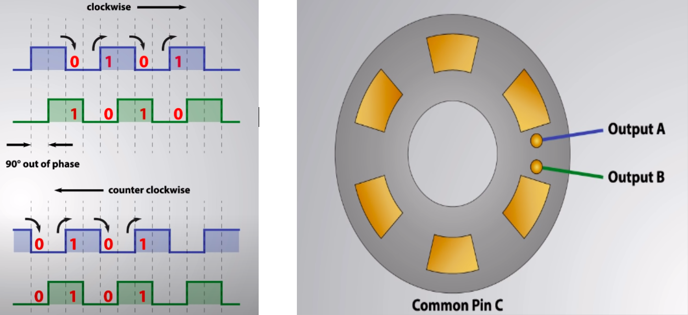

# Проект по Микроконтроллерам

МФТИ, 2021

### Выполняли:
Дмитрий Дроздов Б01-901 \
Даниил Зубко Б01-907


## Краткое описание

В этой работе представлен проект на основе микроконтроллера STM32. В качестве примера,
показывающего возможности этого микроконтроллера, была сделана игра “Фрукты”, в 
которой управляя платформой нужно ловить падающие шарики на светодиодной матрице. 
Взаимодействие человека и микроконтроллера осуществлено с помошью энкодера 
(платформа движется в ту сторону, в какую крутит инкодер игрок). Так же можно 
поставить вместо игрока ИИ, который будет играть сам.


## Модель микроконтроллера и доп комплектующие

* микроконтроллер – STM32 MB1034B на основе процессора
ARM STM32F051RBTx
    + Микроконтроллер STM32F051R8T6, до 48 МГц, 64 KB Flash, 8 KB RAM;
    + Питание платы осуществляется двумя способами: через USB и через внешний источник питания;
    + Напряжение питание от внешнего источника 3 В и 5 В;
    + 4 светодиода: питание 3 В, USB соединение, вывод PC8 и вывод PC9;
    + 2 кнопки: Пользовательская и Reset;
    + Все порты ввода/вывода вынесены на внешний разъем.
    
* энкодер – ALPS

* 4-х разрядный индикатор – 5641AH

* светодиодная матрица 8х8 - 15882m


## Информация о портах


Порты в нижней части рисунка (подписаны как “LDM8x8_x/y”) используются для работы с
светодиодной матрицей 8х8. \
Распиновка матрицы:        


Так же используется TIM2 в режиме 2 для работы с энкодером.
При вращении энкодера генерируется два прямоугольных сигнала(на контакте A(blue) и 
на контакте B(green) ). В зависимости от направления вращения у сигналов разная фаза.
Контакты A & B  подключены к портам таймера. При вращении в одну сторону таймер 
увеличивает значение регистра CNT на 1, в другом уменьшает на 1, в пределах [0, 80].
При переполнении счетчик сбрасывается, при уменьшении на 1 когда CNT == 0, 
устанавливается максимальное значение.



Для 4-х разрядного индикатора используется в сумме 12 портов:


## Програмное обеспечение

Для програмирования используются:
1. CubeMX32 для генерации шаблонных файлов (C библиотека LL) с определением констант для всех портов и так далее.
2. Clion для редактирования кода, прошивки микроконтроллера и его отладки.

В первую очередь были написаны драйвера для 4х разрядного индикатора и для светодиодной матрицы.
Интерфеся по работе с 4х разрядным индикатором имеет вид:

```C++
    void indicatorDisplay(uint64_t num);
```

где num – интегральное число, которое необходимо отобразить (отображается 4 младших разряда). Используется динамическая отрисовка

Интерфейс для светодиодной матрицы:

```C++
    void ldm8x8IndicateMatrix(int matrix[8][8]);

    void ldm8x8IndicateLine(int coord_y, const int *line);
```

У первой функции на вход подается матрица 8х8. Для значений ячеек: 1 – лампочка горит с соответствующими координатами, 0 – не горит.
Вторая функция является вспомогательно для первой и может использоваться, если для отрисовки требуется только одна строка светодиодов, а не вся матрица.